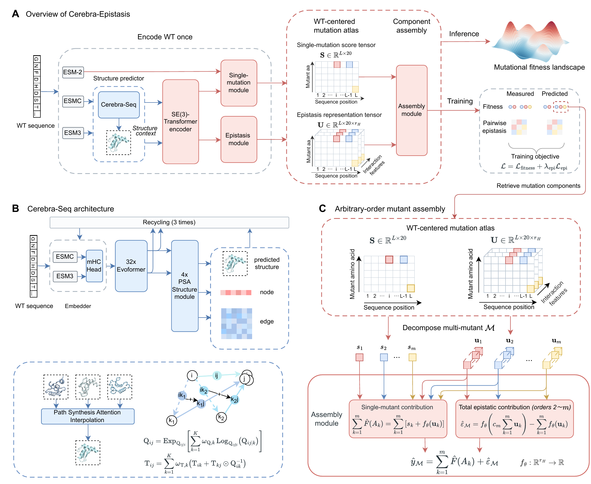

# Cerebra-Epistasis

[](LICENSE)

Cerebra-Epistasis is a PyTorch implementation of a composable, structure- and epistasis-aware framework for protein fitness landscape modeling. The model encodes a wild-type protein once to construct a reusable mutation atlas, from which single-mutation effects and epistatic representations can be assembled to predict arbitrary-order mutant fitness without repeatedly encoding individual mutant sequences.

<p align="center">
  <a href="figures/figure1.pdf">
    
  </a>
</p>

<p align="center">
  <i>Overview of the Cerebra-Epistasis framework. Click the figure to view the PDF version.</i>
</p>

## Repository structure

```text
data/        benchmark settings organized by protein assay, including variant data, WT sequences, and precomputed features
feature/     code for generating ESM-2 and Cerebra-Seq features
model/       Cerebra-Epistasis model code and training scripts
```

## Install

```bash
conda env create -f environment.yml
conda activate cerebra-epistasis
```

## `data/`

Each protein assay is organized as:

```text
data/<setting>/<protein>/
  data.csv
  wt.fasta
  embedding_Cerebra_Seq_for_Cerebra_Epistasis.pt
  embedding_ESM2_650M_for_Cerebra_Epistasis.pt
```

`data.csv` contains the core columns `mutation_name`, `mutated_sequence`, and `label`, corresponding to the mutation notation, full mutant sequence, and experimentally measured fitness value, respectively. Additional columns such as `fold_id` may be included depending on the experimental setting.

`wt.fasta` contains the wild-type protein sequence.

`embedding_Cerebra_Seq_for_Cerebra_Epistasis.pt` contains the precomputed Cerebra-Seq structural representation, while `embedding_ESM2_650M_for_Cerebra_Epistasis.pt` contains the precomputed ESM-2 sequence representation used by Cerebra-Epistasis.

Large benchmark datasets and precomputed features are hosted separately on Zenodo, organized by benchmark setting.

## `feature/`

The `feature/` directory contains code for generating the sequence and structural representations required by Cerebra-Epistasis.

ESM-2 650M is used to generate sequence representations from the wild-type sequence in `wt.fasta`.

Cerebra-Seq is used to generate structural representations and coordinates from the wild-type sequence in `wt.fasta`.

The generated features are stored as:

```text
embedding_ESM2_650M_for_Cerebra_Epistasis.pt
embedding_Cerebra_Seq_for_Cerebra_Epistasis.pt
```

Precomputed features for the benchmark datasets used in the paper are also hosted on Zenodo, organized by benchmark setting.

## `model/`

The `model/` directory contains the Cerebra-Epistasis model code and training scripts. Separate training scripts are provided for each benchmark setting used in the paper.

```text
model/
  cerebra_epistasis/    core Cerebra-Epistasis code
  utils/                shared utilities
  output/               prediction outputs
  training_log/         training logs and model checkpoints
  train_*.py            training scripts for individual benchmark settings
```

Model checkpoints for the benchmark settings are also hosted on Zenodo.

## Released resources

Source code is maintained in this GitHub repository. Large files are distributed separately through Hugging Face and Zenodo.

| Resource | Location |
|---|---|
| Cerebra-Epistasis source code | GitHub |
| Pretrained Cerebra-Seq model weights | Hugging Face |
| Benchmark datasets | Zenodo |
| Precomputed features | Zenodo |
| Benchmark-specific checkpoints | Zenodo |
| Baseline model predictions | Zenodo |

**Hugging Face:** coming soon.  
**Zenodo:** coming soon.

## Citation

If you find Cerebra-Epistasis useful, please cite:

```bibtex
@article{cerebra_epistasis,
  title   = {From single-sequence structure prediction to protein fitness landscapes through a composable, epistasis-aware mutation atlas},
  author  = {...},
  journal = {...},
  year    = {2026}
}
```

## License

This project is licensed under the Apache License 2.0.

Unless otherwise stated, the source code, model architecture, and training scripts in this repository are licensed under Apache-2.0.

Datasets used in this project may be subject to their original licenses and terms of use. Please refer to the corresponding dataset sources for details.

Model weights and external resources may be released under their respective licenses.

This software is provided for research purposes and is not intended for clinical diagnosis, medical decision-making, or direct therapeutic use.