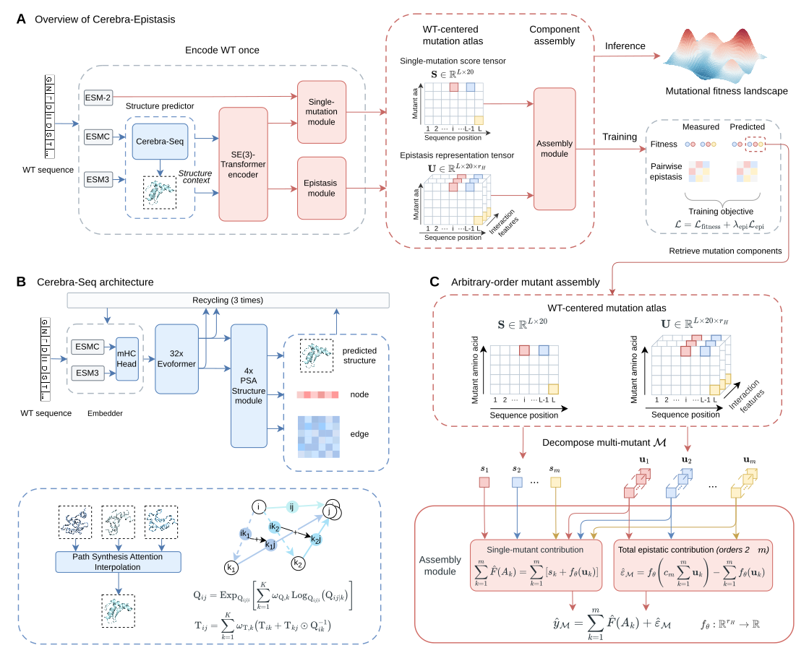

# Cerebra-Epistasis

[](https://www.python.org/)
[](https://github.com/xulab-research/Cerebra-Epistasis/blob/main/LICENSE)
[](https://huggingface.co/GongLab-THU/Cerebra-Seq)
[](https://doi.org/10.5281/zenodo.22899137)
[](https://doi.org/10.64898/2026.09.24.753701)

## Overview

Cerebra-Epistasis is a composable, structure- and epistasis-aware framework for protein fitness landscape modeling. It encodes a wild-type protein once to construct a reusable mutation atlas, from which single-mutation effects and epistatic representations can be assembled to predict arbitrary-order mutant fitness.

**Preprint**: https://doi.org/10.64898/2026.09.06.749687

<p align="center">
  <a href="assets/overview.svg">
    
  </a>
</p>

## Installation

Clone the repository and install the required dependencies:
```bash
git clone https://github.com/xulab-research/Cerebra-Epistasis.git
cd Cerebra-Epistasis
pip install -r requirements.txt
```
The dependency versions are pinned to those used in our tested environment to ensure reproducibility. Newer versions may also be compatible.

## Repository structure

```text
Cerebra-Epistasis/
├── data/
│   ├── data.csv
│   └── wt.fasta
├── generate_features/
│   ├── 01_generate_ESM2_650M_embedding.py
│   └── 02_generate_Cerebra_Seq_features.py
├── model/
│   ├── cerebra_epistasis/
│   ├── utils/
│   └── train.py
├── assets/
├── pyproject.toml
├── LICENSE
└── README.md
```

## Features

- **SE(3)-equivariant structure-aware fitness prediction**: Integrates protein sequence representations with predicted 3D structural information through an SE(3)-equivariant encoder to capture sequence–structure–fitness relationships.

- **Composable mutation atlas**: Represents individual substitutions with additive fitness effects and latent epistatic embeddings, allowing mutations to be flexibly assembled into multi-mutant combinations.

- **Explicit epistasis modeling**: Models non-additive interactions among mutations through a shared nonlinear epistasis module, with direct supervision from experimentally derived epistatic effects when available.

- **Arbitrary-order mutant prediction**: Supports fitness prediction for single and higher-order mutants without explicitly parameterizing every pairwise or higher-order interaction term.

- **Efficient combinatorial inference**: Encodes the wild-type protein once and reuses the resulting mutation atlas to rapidly evaluate large combinatorial mutation spaces.

## Quick Start

### Input data

Place `data.csv` and `wt.fasta` under `data/`.

`data.csv` must contain:

```text
mutation_name
label
fold_id
```

`mutation_name` specifies the amino-acid substitution(s) using 0-based residue indexing, with multiple substitutions separated by commas. `label` contains the experimentally measured fitness value. `fold_id=0` is used for training and `fold_id=1` for testing.

### Feature generation

Cerebra-Epistasis uses **ESM-2 650M** sequence representations and **Cerebra-Seq** structural representations derived from the wild-type sequence.

```bash
cd generate_features
python 01_generate_ESM2_650M_embedding.py
python 02_generate_Cerebra_Seq_features.py
```

The generated files are:

```text
data/embedding_ESM2_650M_for_Cerebra_Epistasis.pt
data/embedding_Cerebra_Seq_for_Cerebra_Epistasis.pt
```

Cerebra-Seq is available on [Hugging Face](https://huggingface.co/GongLab-THU/Cerebra-Seq).

### Training and prediction

```bash
cd model
python train.py
```

Training logs and checkpoints are written to `model/training_log/`, and predictions to `model/output/`.

Use `python train.py --help` to view available arguments.

## Resources

| Resource | Location |
|---|---|
| Cerebra-Epistasis source code | [GitHub](https://github.com/xulab-research/Cerebra-Epistasis) |
| Cerebra-Seq | [Hugging Face](https://huggingface.co/GongLab-THU/Cerebra-Seq) |
| Cerebra-Epistasis code, benchmark datasets, precomputed features, and prediction outputs | [Zenodo](https://doi.org/10.5281/zenodo.22899137) |

## Citation

If you use Cerebra-Epistasis in your research, please cite:

```bibtex
@article{cerebra_epistasis,
  title   = {From single-sequence structure prediction to protein fitness landscape through a composable, epistasis-aware mutation atlas},
  author  = {Weizhe Wang, Zimu Yu, Endi Yang, Ziyu Shi, Shize Yu, Jian Hu, Yunxin Xu, Haipeng Gong},
  journal = {bioRxiv},
  year    = {2026},
  doi     = {10.64898/2026.09.24.753701},
  url     = {https://doi.org/10.64898/2026.09.24.753701}
}
```

## License

This project is licensed under the Apache License 2.0.

Unless otherwise stated, the source code, model architecture, training scripts,
inference scripts, and released model weights/checkpoints are licensed under
Apache-2.0.

Datasets used in this project may be subject to their original licenses and
terms of use. Please refer to the corresponding dataset sources for details.

This software is provided for research purposes and is not intended for clinical
diagnosis, medical decision-making, or direct therapeutic use.
